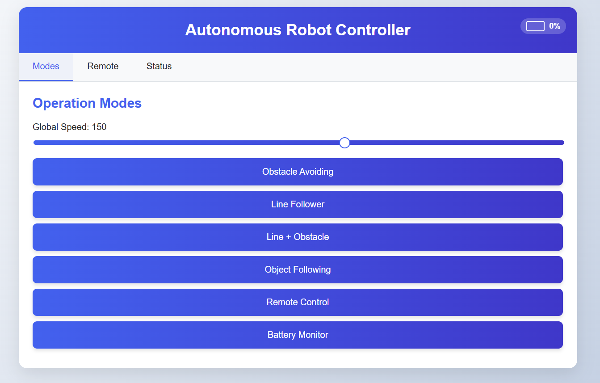
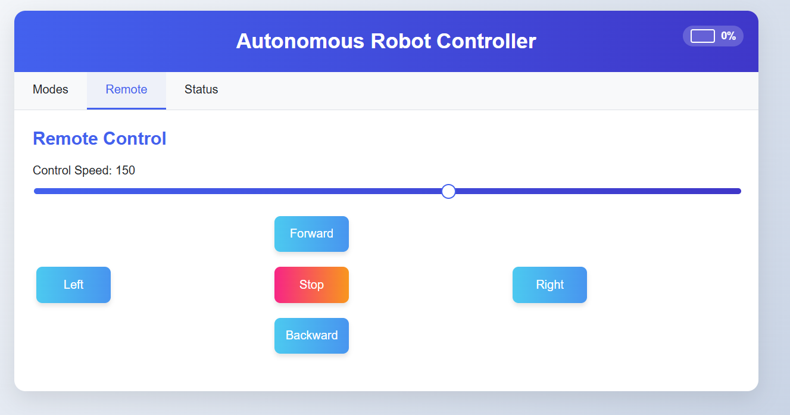
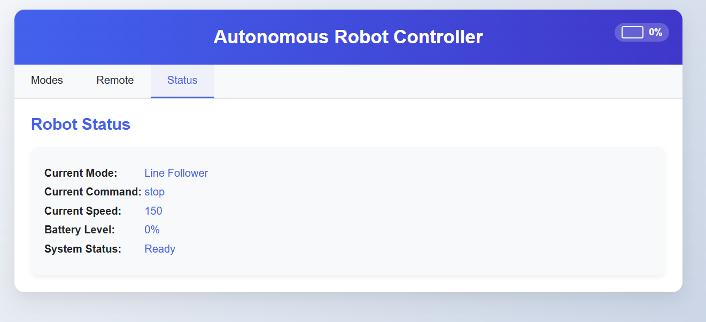
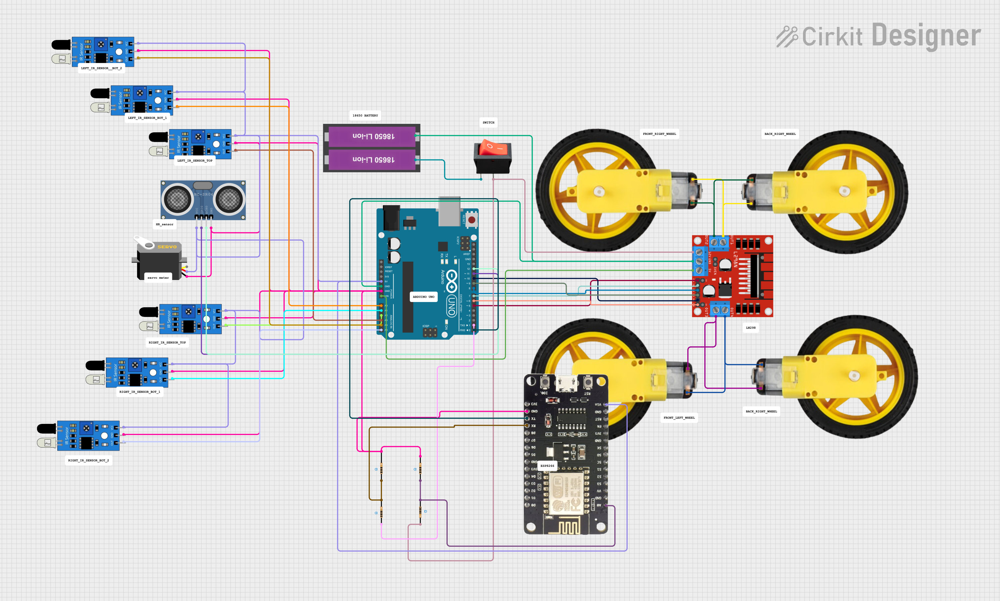

# 🤖 MultiMode Robot Car - Autonomous Navigation System

<div align="center">


**A sophisticated multi-mode robot car featuring autonomous navigation, obstacle avoidance, line following, and web-based remote control.**

[Features](#-features) • [Hardware](#%EF%B8%8F-hardware-overview) • [Installation](#-installation--setup) • [Usage](#-usage) • [Demo](#-demo)

</div>

---

## 📖 Table of Contents

- [Overview](#-overview)
- [Interface Previews](#-interface-previews)
- [Features](#-features)
- [Hardware Overview](#%EF%B8%8F-hardware-overview)
- [Software Stack](#-software-stack)
- [Installation & Setup](#-installation--setup)
- [Usage](#-usage)
- [Operation Modes](#-operation-modes)
- [Folder Structure](#-folder-structure)
- [Demo](#-demo)
- [Troubleshooting](#-troubleshooting)
- [Future Enhancements](#-future-enhancements)
- [Contributing](#-contributing)
- [License](#-license)
- [Contact](#-contact)

---

## 🌟 Overview

The **MultiMode Robot Car** is an intelligent robotics platform built on Arduino and ESP8266 that demonstrates advanced autonomous navigation capabilities. This project combines hardware control, sensor fusion, and web technologies to create a versatile robot capable of operating in multiple modes.

### Key Highlights:
- ✅ **6 Operation Modes** - From manual control to fully autonomous navigation
- ✅ **Web Interface** - Control via any device with a browser
- ✅ **Real-time Monitoring** - Live status updates and battery monitoring
- ✅ **Modular Design** - Easy to extend and customize
- ✅ **Low Cost** - Built with readily available components

---

## 📸 Interface Previews

### 🧭 Modes Tab
*Select and switch between different operation modes*


### 🎮 Remote Control
*Manual control with directional buttons and speed control*


### 📊 Status Monitor
*Real-time system status, sensor readings, and battery level*


---

## 🚗 Features

### 🎯 Multiple Operation Modes
- **🚧 Obstacle Avoidance** - Automatically detects and navigates around obstacles using ultrasonic sensor
- **🛣️ Line Following** - Follows black lines using IR sensor array
- **🔄 Hybrid Mode** - Combines obstacle avoidance with line following
- **🎯 Object Tracking** - Tracks and follows objects using servo-mounted ultrasonic sensor
- **🕹️ Manual Remote Control** - Full directional control via web interface
- **🔋 Battery Monitor** - Real-time voltage monitoring and low battery alerts

### 🌐 Web-Based Control Panel
- **Responsive Design** - Works on desktop, tablet, and mobile devices
- **Real-time Updates** - Live sensor data and system status
- **Intuitive Interface** - User-friendly tabs for different functions
- **Speed Control** - Adjustable motor speed with slider
- **Wi-Fi Connectivity** - Access from anywhere on the network

### ⚙️ Advanced Features
- **Sensor Fusion** - Combines data from multiple sensors for better decision making
- **Serial Communication** - Arduino ↔ ESP8266 communication protocol
- **Modular Architecture** - Easy to add new features or sensors
- **Safety Mechanisms** - Edge detection and emergency stop features

---

## 🛠️ Hardware Overview

### 📷 Circuit Diagram


### 🔧 Bill of Materials (BOM)

| Quantity | Component | Specification | Purpose |
|----------|-----------|---------------|---------|
| 1 | Arduino UNO | ATmega328P | Main controller for robot logic |
| 1 | ESP8266 / NodeMCU | ESP-12E | Wi-Fi web server |
| 1 | L298N Motor Driver | Dual H-Bridge | Controls 4 DC motors |
| 4 | TT Gear Motors | 3-6V DC | Robot locomotion |
| 4 | Robot Wheels | 65mm diameter | Compatible with TT motors |
| 6 | IR Sensors | TCRT5000 | Line detection and edge avoidance |
| 1 | Ultrasonic Sensor | HC-SR04 | Distance measurement (2-400cm) |
| 1 | Servo Motor | SG90 (9g) | Pan ultrasonic sensor |
| 2 | 18650 Li-ion Batteries | 3.7V, 2600mAh | Power supply |
| 1 | Battery Holder | 2x 18650 | Battery mounting |
| 1 | Power Switch | SPST | Main power control |
| 1 | Voltage Regulator | 7805 (Optional) | 5V regulated output |
| - | Jumper Wires | M-M, M-F | Connections |
| - | Resistors | Various values | Circuit protection |
| 1 | Robot Chassis | Acrylic/Plastic | Mounting platform |

### 🔌 Pin Configuration

#### Arduino UNO Connections:
```
Motors (via L298N):
- IN1, IN2, IN3, IN4 → Digital Pins 4, 5, 6, 7
- ENA, ENB → PWM Pins 9, 10 (speed control)

Sensors:
- Ultrasonic TRIG → Pin 12
- Ultrasonic ECHO → Pin 13
- Servo Signal → Pin 11
- IR Sensors → Analog Pins A0-A5

Communication:
- TX/RX → Pins 0, 1 (Serial to ESP8266)
```

#### ESP8266 Connections:
```
- TX/RX → To Arduino RX/TX
- GPIO Pins → Status LEDs (optional)
```

---

## 💻 Software Stack

| Layer | Technology | Description |
|-------|------------|-------------|
| **Microcontroller** | Arduino UNO (ATmega328P) | Main control logic, sensor processing, motor control |
| **Web Server** | ESP8266 / NodeMCU | Hosts web interface, handles Wi-Fi connections |
| **Frontend** | HTML5, CSS3, JavaScript | Responsive web UI with AJAX for real-time updates |
| **Backend** | Arduino C/C++ | Firmware for robot behavior and control algorithms |
| **Communication** | Serial (UART) | Arduino ↔ ESP8266 data exchange |
| **File System** | LittleFS / SPIFFS | Stores web files on ESP8266 flash memory |
| **Development IDE** | Arduino IDE / PlatformIO | Firmware development and upload |

### 📚 Key Libraries Used:
- **Servo.h** - Servo motor control
- **ESP8266WiFi.h** - Wi-Fi connectivity
- **ESP8266WebServer.h** - Web server functionality
- **LittleFS.h** - File system management

---

## 🧪 Installation & Setup

### Prerequisites
- Arduino IDE (version 1.8.13 or later)
- ESP8266 Board Package installed in Arduino IDE
- USB cable for programming
- Basic soldering skills

### Step 1: 🧩 Hardware Assembly

1. **Mount Components** on the robot chassis:
   - Secure Arduino UNO and ESP8266
   - Mount L298N motor driver
   - Attach motors to wheels and chassis
   - Install IR sensors at the bottom (for line following)
   - Mount ultrasonic sensor on servo motor
   - Install battery holder

2. **Wire Connections** according to the circuit diagram:
   - Connect motors to L298N outputs
   - Wire L298N inputs to Arduino
   - Connect all sensors to Arduino
   - Link Arduino to ESP8266 via serial (TX-RX, RX-TX)
   - Connect power supply

3. **Test Power Supply**:
   - Verify voltage levels (7-12V for Arduino via L298N)
   - Check ESP8266 receives 3.3V (use voltage divider if needed)

### Step 2: 🧑‍💻 Software Installation

#### A. Arduino IDE Setup

1. **Install ESP8266 Board Support:**
   ```
   File → Preferences → Additional Board Manager URLs
   Add: http://arduino.esp8266.com/stable/package_esp8266com_index.json
   Tools → Board → Boards Manager → Search "ESP8266" → Install
   ```

2. **Install Required Libraries:**
   ```
   Sketch → Include Library → Manage Libraries
   Search and install:
   - Servo (by Michael Margolis)
   - ESP8266WiFi
   - ESP8266WebServer
   ```

#### B. Upload Arduino Code

1. Open `code/arduino_uno/robot_controller.ino`
2. Select Board: **Arduino UNO**
3. Select correct **COM Port**
4. Click **Upload**
5. Open Serial Monitor (115200 baud) to verify

#### C. Upload ESP8266 Code

1. Open `code/esp8266_code/web_server.ino`
2. **Configure Wi-Fi credentials** (if using station mode):
   ```cpp
   const char* ssid = "YourWiFiName";
   const char* password = "YourPassword";
   ```
3. Select Board: **NodeMCU 1.0 (ESP-12E Module)**
4. Upload Speed: **115200**
5. Select correct **COM Port**
6. Click **Upload**
7. Open Serial Monitor to get IP address

#### D. Upload Web Interface Files (if using file system)

1. Install **ESP8266 Sketch Data Upload** plugin
2. Place HTML/CSS/JS files in `data/` folder
3. Tools → **ESP8266 Sketch Data Upload**

### Step 3: 🌐 Access Web Interface

1. **Connect to Wi-Fi:**
   - **AP Mode**: Connect to "RobotCar_AP" network
   - **Station Mode**: Connect to same network as ESP8266

2. **Open Browser:**
   - Navigate to `http://192.168.4.1` (AP mode)
   - Or use IP address shown in Serial Monitor (Station mode)

3. **Start Controlling!**
   - Select mode in the Modes tab
   - Use Remote tab for manual control
   - Monitor status in Status tab

---

## 🎮 Usage

### Basic Operation

1. **Power On** the robot using the power switch
2. **Wait** for ESP8266 to boot (LED indicators will stabilize)
3. **Connect** to the web interface
4. **Select Mode** from the Modes tab
5. **Adjust Speed** using the slider if needed
6. **Monitor** status and sensor readings

### Web Interface Guide

#### 🧭 Modes Tab
- **Mode Selection**: Click on any mode button to activate
- **Speed Control**: Use slider to adjust motor speed (0-255)
- **Auto/Manual Toggle**: Switch between autonomous and manual control
- **Emergency Stop**: Red stop button halts all motors immediately

#### 🎮 Remote Control Tab
- **Directional Controls**: ⬆️ Forward, ⬇️ Backward, ⬅️ Left, ⬅️ Right
- **Stop Button**: Center button to stop movement
- **Speed Adjustment**: Sync with global speed slider

#### 📊 Status Tab
- **Battery Level**: Current voltage and percentage
- **Sensor Readings**: Live data from IR and ultrasonic sensors
- **Connection Status**: Wi-Fi signal strength
- **Mode Indicator**: Currently active mode

---

## 🧭 Operation Modes

### 1. 🚧 Obstacle Avoidance Mode
**How it works:**
- Ultrasonic sensor continuously scans forward
- When obstacle detected within threshold (20cm):
  - Robot stops
  - Servo scans left and right
  - Chooses direction with more clearance
  - Turns and continues

**Best for:** Open spaces with scattered obstacles

### 2. 🛣️ Line Following Mode
**How it works:**
- IR sensors detect black line on white surface
- PID control adjusts motor speeds to stay centered
- Edge detection prevents falling off surfaces

**Best for:** Defined tracks, maze solving

### 3. 🔄 Hybrid Mode (Obstacle + Line)
**How it works:**
- Primarily follows line
- If obstacle detected ahead:
  - Temporarily leaves line
  - Navigates around obstacle
  - Returns to line following

**Best for:** Complex environments with lines and obstacles

### 4. 🎯 Object Tracking Mode
**How it works:**
- Servo sweeps ultrasonic sensor
- Identifies nearest object
- Maintains set distance while following

**Best for:** Following a person or moving object

### 5. 🕹️ Manual Remote Control
**How it works:**
- Direct control via web interface
- Real-time command execution
- Variable speed control

**Best for:** Precise navigation, testing

### 6. 🔋 Battery Monitor Mode
**How it works:**
- Continuous voltage monitoring
- Alerts when battery low
- Prevents over-discharge

**Best for:** System health checking

---

## 📁 Folder Structure

```
MultiMode-RobotCar/
│
├── code/
│   ├── arduino_uno/
│   │   ├── robot_controller.ino       # Main Arduino firmware
│   │   ├── motor_control.h            # Motor driver functions
│   │   ├── sensors.h                  # Sensor reading functions
│   │   └── modes.h                    # Operation mode logic
│   │
│   └── esp8266_code/
│       ├── web_server.ino             # ESP8266 web server code
│       ├── data/                      # Web files for SPIFFS/LittleFS
│       │   ├── index.html             # Main web interface
│       │   ├── style.css              # Styling
│       │   └── script.js              # Client-side logic
│       └── config.h                   # Wi-Fi configuration
│
├── gui_design_png/
│   ├── main_controller_tab.png        # Interface screenshot
│   ├── remote_control_tab.png         # Remote control UI
│   └── status_tab.png                 # Status monitor
│
├── circuit_diagram_image.png          # Wiring diagram
├── multi_mode_robot_working_video.mp4 # Demo video
│
├── .gitignore                         # Git ignore rules
├── LICENSE                            # MIT License
└── README.md                          # This file
```

---

## 🎬 Demo

### Video Demonstration
[📹 Watch the robot in action!](multi_mode_robot_working_video.mp4)

### Test Scenarios
- ✅ Obstacle avoidance in cluttered environment
- ✅ Line following on curved track
- ✅ Hybrid mode navigating complex course
- ✅ Remote control responsiveness test
- ✅ Battery monitoring and low voltage alert

---

## 🔧 Troubleshooting

### Common Issues and Solutions

#### 🚫 Robot doesn't move
- **Check power supply**: Ensure batteries are charged
- **Verify connections**: Motor driver wiring correct?
- **Test motors individually**: Connect directly to battery
- **Serial debug**: Check if commands are received

#### 📡 Can't connect to web interface
- **Check ESP8266 power**: LED should be on
- **Verify Wi-Fi**: Is robot's network visible?
- **Serial monitor**: Check for IP address and errors
- **Reset ESP8266**: Press reset button and wait

#### 📏 Inaccurate sensor readings
- **Clean sensors**: Dust can affect IR and ultrasonic
- **Check alignment**: Sensors should face correct direction
- **Verify voltage**: Low battery affects sensor accuracy
- **Test individually**: Serial monitor sensor outputs

#### 🔋 Battery drains quickly
- **Reduce speed**: Lower PWM values save power
- **Check for shorts**: Inspect all connections
- **Motor efficiency**: Ensure wheels spin freely
- **Use sleep modes**: Implement power-saving in code

#### 🐌 Slow web interface response
- **Signal strength**: Move closer to robot
- **Reduce update rate**: Modify AJAX polling interval
- **ESP8266 memory**: Simplify web page if needed

---

## ✨ Future Enhancements

### Planned Features
- [ ] 🛰️ **GPS Integration** - Outdoor navigation and waypoint following
- [ ] 📱 **Mobile App** - Native Android/iOS control application
- [ ] 📷 **Camera Module** - ESP32-CAM for live video streaming
- [ ] 🔋 **Advanced Battery Management** - Real-time voltage sensing and charging circuit
- [ ] 🗣️ **Voice Control** - Integration with Google Assistant/Alexa
- [ ] 🤖 **Machine Learning** - TensorFlow Lite for object recognition
- [ ] 📡 **Long Range Control** - LoRa module for extended range
- [ ] 🎮 **Gamepad Support** - Bluetooth controller compatibility
- [ ] 🗺️ **SLAM** - Simultaneous Localization and Mapping
- [ ] 🌡️ **Environmental Sensors** - Temperature, humidity, gas detection

### Contribution Ideas
- Implement PID tuning interface in web UI
- Add data logging to SD card
- Create mobile app with React Native
- Develop obstacle mapping visualization
- Add multiplayer racing mode

---

## 🤝 Contributing

Contributions are welcome! Whether it's bug fixes, new features, or documentation improvements.

### How to Contribute

1. **Fork** the repository
2. **Create** a feature branch (`git checkout -b feature/AmazingFeature`)
3. **Commit** your changes (`git commit -m 'Add some AmazingFeature'`)
4. **Push** to the branch (`git push origin feature/AmazingFeature`)
5. **Open** a Pull Request

### Contribution Guidelines
- Follow existing code style
- Comment your code clearly
- Test thoroughly before submitting
- Update documentation if needed
- Include demo/screenshot if applicable

---

## 📃 License

This project is licensed under the **MIT License** - see the [LICENSE](LICENSE) file for details.

```
MIT License - Copyright (c) 2026 Saviru Subasith Ferdinando

Permission is hereby granted, free of charge, to any person obtaining a copy
of this software and associated documentation files...
```

**Feel free to use, modify, and distribute for personal or educational purposes! 🎓**

---

## 👤 Author & Contact

**Saviru Subasith Ferdinando**

- GitHub: [@Saviru1](https://github.com/Saviru1)
- Project Link: [MultiMode-RobotCar](https://github.com/Saviru1/MultiMode-RobotCar)

### Acknowledgments
- Arduino Community for excellent libraries and support
- ESP8266 Community for Wi-Fi modules and examples
- Robotics enthusiasts worldwide for inspiration

---

## ⭐ Support

If you found this project helpful, please consider:
- ⭐ **Starring** the repository
- 🐛 **Reporting** bugs or issues
- 💡 **Suggesting** new features
- 📢 **Sharing** with others

---

<div align="center">

**Made with ❤️ and ☕ by Saviru Subasith Ferdinando**

*Happy Building! 🤖🚗*

</div>
